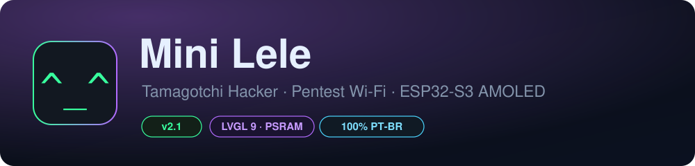
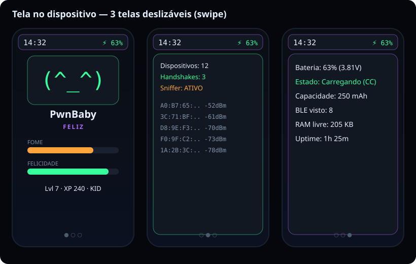
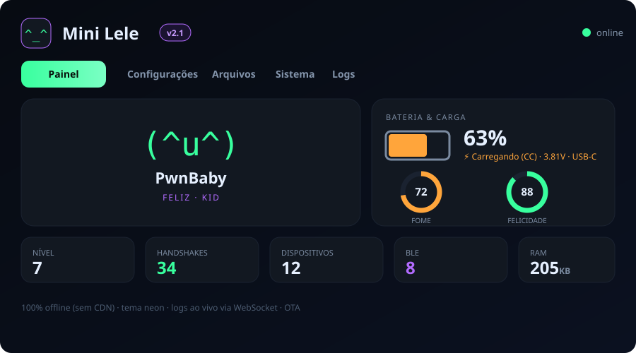
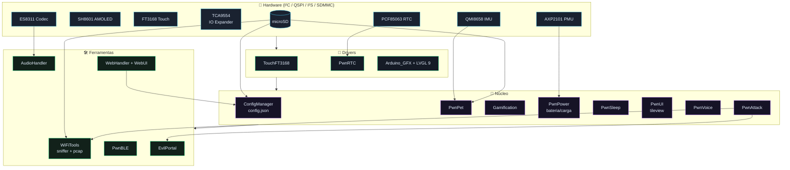
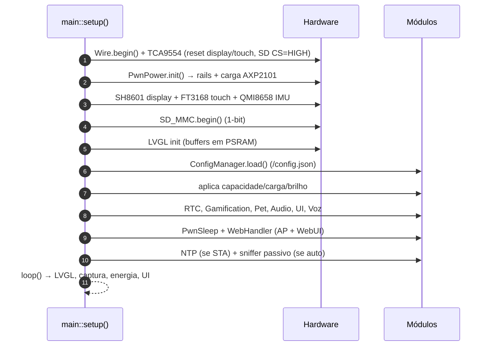
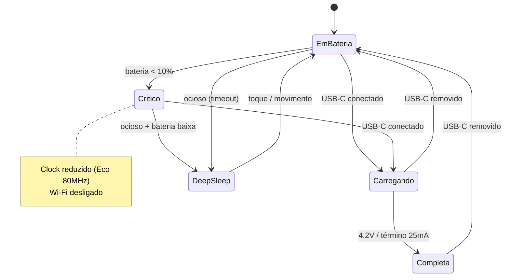
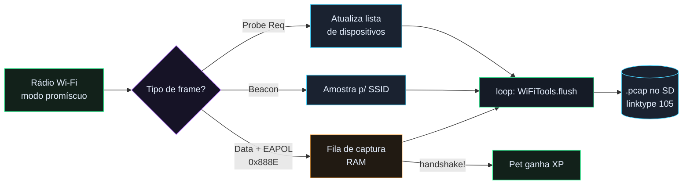
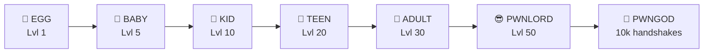
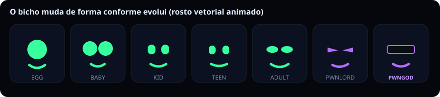

<!-- Banner -->
<p align="center">
  
</p>

<p align="center">
  
  
  
  
  
  
  
</p>

<p align="center">
  <b>Tamagotchi Hacker + laboratório de pentest Wi‑Fi de bolso</b>, 100% em Português‑BR,<br>
  para a placa <b>Waveshare ESP32‑S3‑Touch‑AMOLED‑1.8</b>.
</p>

---

## 📑 Índice

- [Visão geral](#-visão-geral)
- [Destaques](#-destaques)
- [Prévia](#-prévia)
- [Arquitetura](#-arquitetura)
- [Sequência de boot](#-sequência-de-boot)
- [Energia & carregamento](#-energia--carregamento-usb-c)
- [Pipeline de captura Wi‑Fi](#-pipeline-de-captura-wi-fi)
- [Evolução do pet](#-evolução-do-pet)
- [Hardware & pinagem](#-hardware--pinagem)
- [Instalação](#-instalação)
- [WebUI & comandos](#-webui--comandos-de-voz)
- [Referência de configuração](#-referência-de-configuração)
- [Estrutura do repositório](#-estrutura-do-repositório)
- [Roadmap](#-roadmap)
- [Aviso legal](#-aviso-legal)
- [Licença](#-licença)

---

## 🧭 Visão geral

O **Mini Lele** combina um **pet virtual** que evolui conforme você explora o
espectro Wi‑Fi/BLE com **ferramentas reais** de análise de redes — tudo numa
tela AMOLED sensível ao toque, com WebUI, voz offline e gerenciamento de energia
para bateria LiPo.

| | |
|---|---|
| **Placa** | Waveshare ESP32‑S3‑Touch‑AMOLED‑1.8 |
| **MCU** | ESP32‑S3R8 · dual‑core 240 MHz · 8 MB PSRAM · 16 MB Flash |
| **Tela** | AMOLED 1.8" 368×448 (SH8601, QSPI) + toque FT3168 |
| **Sensores** | IMU QMI8658 · RTC PCF85063 · Codec ES8311 (mic/alto‑falante) |
| **Energia** | PMU AXP2101 · carga LiPo por USB‑C · bateria configurável |
| **UI** | LVGL 9 (PSRAM, double‑buffer) + WebUI offline responsiva |

---

## ✨ Destaques

- 🐣 **Pet evolutivo e vivo** — bicho **procedural animado** (olhos e boca vetoriais que piscam, olham em volta e "respiram", com movimentos quase infinitos e leves), que **muda de espécie** conforme evolui: Egg → Baby → Kid → Teen → Adult → PwnLord → **PwnGod**.
- 📡 **Captura Wi‑Fi real** — sniffer promíscuo, `.pcap` de verdade (linktype 105), detecção de **EAPOL/handshake**.
- 🔵 **Scanner BLE** — dispositivos Bluetooth LE viram "comida" extra do pet.
- 🔋 **Carga por USB‑C** — via AXP2101, com **capacidade de bateria configurável** (troque a célula sem recompilar).
- 😴 **Economia de energia** — timeout de tela, auto‑dim, deep sleep com acordar por toque/movimento.
- 🕹 **Interação física** — chacoalhar alimenta o pet (IMU); botão para trocar de tela.
- 🕐 **Relógio real (RTC)** — hora certa na tela e nos logs, com sincronização NTP.
- 🌐 **WebUI offline** — dashboard neon 100% autocontido (sem CDN), OTA, logs ao vivo, gerenciador de arquivos.
- 🗣 **Voz offline PT‑BR** — comandos por contagem de sílabas + feedback em áudio.
- 🖥 **Anti‑burn‑in** — deslocamento de pixels e dimming para preservar o AMOLED.

---

## 🖼 Prévia

### Tela no dispositivo (navegação por gestos)

<p align="center"></p>

### WebUI (navegador — funciona offline no modo AP)

<p align="center"></p>

> 💡 Abra `webui_preview.html` no navegador para uma prévia interativa da WebUI.

---

## 🧩 Arquitetura



Veja **[docs/ARQUITETURA.md](docs/ARQUITETURA.md)** para o detalhamento de cada módulo.

---

## 🔁 Sequência de boot



---

## 🔋 Energia & carregamento (USB‑C)

O **AXP2101** cuida da carga por hardware — basta conectar o **USB‑C**. O firmware
apenas aplica parâmetros **seguros** para a célula instalada.

> 🔧 **Bateria inicial:** LiPo **PL502030 · 250 mAh · 3,7 V**.
> A **capacidade é configurável** (`pwr_battery_capacity_mah`): ao trocar por uma
> célula maior, basta alterar o valor na WebUI — **sem mexer no código**.

| Parâmetro | Valor padrão | Observação |
|-----------|--------------|------------|
| Corrente de carga (CC) | **100 mA** (~0,4C) | ajustável: 100/125/150/200 mA · use ≤ 0,5C |
| Tensão de corte | **4,2 V** | padrão LiPo de 1 célula |
| Corrente de término | **25 mA** (~0,1C) | encerra a carga corretamente |
| Detecção do pino TS | **desligada** | obrigatório p/ célula sem termistor |
| Aviso / desligamento | **10% / 5%** | proteção da célula |



---

## 📡 Pipeline de captura Wi‑Fi

O callback promíscuo é **rápido** (só copia frames de interesse para a RAM); a
gravação lenta no SD acontece no loop principal — evitando travar o driver Wi‑Fi.



---

## 🐣 Evolução do pet



A cada estágio o bicho ganha uma **aparência diferente** (formato dos olhos e da
boca), reforçando a sensação de criaturas distintas conforme cresce:

<p align="center"></p>

Handshakes WPA (+XP), atividade de rede e carinho (chacoalhar) aumentam XP, fome
e felicidade. Os stats persistem no SD **e** na RAM RTC (sobrevive ao deep sleep).

### 🎞 Pet vivo (animação leve)

O rosto é desenhado com **primitivas vetoriais do LVGL** (não usa imagens nem
fontes), animado por um motor a ~30 FPS que combina, de forma aleatória e
contínua: **piscar**, **olhar para os lados** (saccades), **respiração/balanço**
e **transições suaves de expressão**. Como esses parâmetros se combinam ao acaso,
o bicho praticamente nunca fica igual — parece realmente vivo.

É **leve** porque só os poucos objetos que se movem são redesenhados (partial
redraw do LVGL), sem alocação por quadro, e a animação **pausa sozinha** quando a
tela apaga (economia de bateria).

---

## 🧷 Hardware & pinagem

> ⚠️ **Pinos corrigidos na v2.1** (conferidos na wiki oficial Waveshare):
> `SD_D0 = GPIO3` (era 42) e **amplificador em GPIO46** (não no expansor).

| Bloco | Sinais (GPIO) |
|-------|---------------|
| **Display QSPI (SH8601)** | CS 12 · SCLK 11 · SDIO0‑3 = 4/5/6/7 · RST via EXIO0 |
| **I²C** (touch/PMU/IMU/RTC/IO) | SDA 15 · SCL 14 |
| **Touch FT3168** | INT 21 · addr 0x38 |
| **Áudio I²S (ES8311)** | MCLK 16 · BCLK 9 · WS 45 · DO 8 · DI 10 · **PA 46** |
| **Cartão SD (SDMMC 1‑bit)** | CLK 2 · CMD 1 · **D0 3** · **CS = EXIO7** |
| **Botão** | BOOT (GPIO0) |

Endereços I²C: AXP2101 `0x34` · FT3168 `0x38` · TCA9554 `0x20` · QMI8658 `0x6B`
· ES8311 `0x18` · PCF85063 `0x51`. Detalhes em **[HARDWARE.md](HARDWARE.md)** e
**[FULL_HARDWARE.md](FULL_HARDWARE.md)**.

---

## 🚀 Instalação

```bash
git clone https://github.com/lelebrr/mini.git
cd mini
```

1. **VS Code + PlatformIO IDE** e Python 3.x.
2. **Primeira compilação precisa de internet:** a maioria das libs é vendorizada
   em `lib/`, mas `XPowersLib`, `AsyncTCP` e `ESPAsyncWebServer` são baixadas
   automaticamente (depois ficam em cache). O touch usa um driver interno próprio.
3. Prepare o **cartão SD** (FAT32): rode `sh generate_sd_structure.sh` e copie
   `sd_out/` para a raiz.
4. Ambiente **`waveshare-esp32-s3-amoled`** → **Build** → **Upload**.
5. Primeiro boot: acompanhe o log serial (USB‑CDC, `115200`).

Guia completo em **[INSTALACAO.md](INSTALACAO.md)** · detalhes do PlatformIO em
**[README_PlatformIO.md](README_PlatformIO.md)**.

---

## 🌐 WebUI & comandos de voz

**WebUI** — modo AP padrão: SSID `Mini-Lele`, senha `minilele`, acesse
`http://192.168.4.1` (portal cativo redireciona qualquer URL). Abas: Painel,
Configurações (100+ opções agrupadas), Arquivos (upload/download), Sistema (OTA,
reiniciar) e Logs ao vivo.

**Voz (offline, PT‑BR)** — comandos por contagem de sílabas: "Status", "Bateria",
"Ataque". Ver **[MANUAL.md](MANUAL.md)**.

---

## ⚙️ Referência de configuração

Todas as chaves ficam em `/config.json` (SD) e são editáveis pela WebUI.

| Grupo | Exemplos de chaves |
|-------|--------------------|
| 🐣 `pet_` | `pet_name`, `pet_voice_enabled`, `pet_hunger_rate` |
| 🖥 `disp_` | `disp_brightness`, `disp_timeout_sec`, `disp_theme` |
| 🔋 `pwr_` | **`pwr_battery_capacity_mah`**, `pwr_charge_current_ma`, `pwr_deep_sleep_enabled`, `pwr_deep_sleep_after_sec` |
| 📡 `atk_` | `atk_auto_scan`, `atk_deauth_enabled`, `atk_evil_portal`, `atk_ble_scan` |
| ⚙️ `sys_` | `sys_ap_ssid`, `sys_wifi_mode`, `sys_ntp_server`, `sys_timezone`, `sys_watchdog` |
| 🌐 `web_` | `web_live_logs`, `web_theme` |

---

## 📂 Estrutura do repositório

```
mini/
├── src/            main.cpp (integra tudo) · core_singletons.cpp · legacy/ (não compilado)
├── include/
│   ├── core/       PwnPet, PwnPower, PwnUI, PwnSleep, PwnBLE, PwnAttack, PwnVoice, ConfigManager
│   ├── drivers/    TouchFT3168, PwnRTC, PwnIMU
│   ├── web/        WebHandler, WebAssets (WebUI embutida)
│   └── *.h         WiFiTools, EvilPortal, AudioHandler, Gamification, FaceHandler...
├── lib/            bibliotecas vendorizadas (lvgl, ArduinoJson, Arduino_GFX, SensorLib, es8311...)
├── docs/           documentação + diagramas/imagens
├── demo/           exemplos oficiais Waveshare
├── arquivos_cartao_sd/   estrutura base do cartão SD
├── platformio.ini  ambiente de build
└── generate_sd_structure.sh
```

---

## 🗺 Roadmap

- [x] Integração completa da arquitetura v2.0
- [x] Carga USB‑C + capacidade configurável
- [x] RTC/NTP, economia de energia, IMU, BLE
- [x] Captura `.pcap` real + EAPOL
- [x] WebUI offline + UI por gestos
- [ ] Upload automático para wpa‑sec agendado
- [ ] Temas de tela adicionais
- [ ] Parser PMKID/hashcat 22000 no dispositivo

---

## ⚠️ Aviso legal

Firmware **exclusivamente educacional**, para uso em redes **próprias** ou com
**autorização explícita**. Deauth, captura de handshakes e portais cativos sem
autorização são **ilegais** em muitos países. Ao usar o Mini Lele, você concorda
em respeitar a legislação local e assume total responsabilidade pelo uso.

---

## 📄 Licença

Distribuído sob a licença **GNU GPLv3** — veja [LICENSE](LICENSE).

<p align="center"><sub>Feito com 💚 em Português‑BR · contribuições bem‑vindas (veja <a href="CONTRIBUTING.md">CONTRIBUTING.md</a>)</sub></p>
