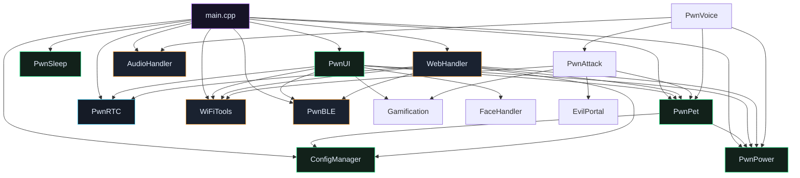
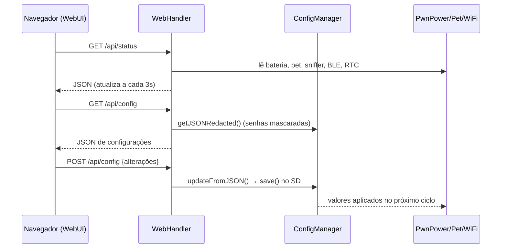

# Arquitetura do Mini Lele

Documento técnico dos módulos, do fluxo de dados e do modelo de execução.
Para a visão rápida, veja o [README](../README.md).

---

## Modelo de execução

Firmware Arduino de **tarefa única** (loop cooperativo), sem RTOS explícito além
do que o core ESP32 já fornece. Nada bloqueia o loop:

- **`setup()`** inicializa hardware → LVGL → camada de aplicação.
- **`loop()`** roda o LVGL a cada ~5 ms e distribui tarefas por tempo:
  - a cada tick: `WiFiTools::flush()`, `WebHandler::loop()` (DNS), `EvilPortal::loop()`, `checkShake()`, `checkButton()`, `esp_task_wdt_reset()`
  - a cada 1 s: `PwnPet::tick`, `Gamification::tick`, `PwnPower::monitor`, `PwnAttack::tick`, `PwnSleep::tick`, `PwnUI::update`
  - por intervalo: varredura BLE, persistência de logs

O **callback promíscuo do Wi‑Fi** roda em contexto sensível do driver, então ele
**apenas copia** frames para um buffer em RAM; a gravação no SD ocorre no loop.

---

## Diagrama de dependências

> Todos os módulos são **classes com membros estáticos** (estilo singleton). As
> definições dos estáticos ficam centralizadas em `src/core_singletons.cpp`, e os
> headers que definem estáticos incluídos em várias unidades usam `inline`
> (FaceHandler, EvilPortal, WebHandler) — evitando erros de *multiple definition*.

---

## Módulos

### Núcleo (`include/core/`)

| Módulo | Responsabilidade | Métodos‑chave |
|--------|------------------|---------------|
| **ConfigManager** | Config persistente em `/config.json` (100+ chaves), merge de defaults, API JSON para a WebUI (senhas mascaradas) | `load`, `save`, `get<T>`, `getJSONRedacted`, `updateFromJSON` |
| **PwnPet** | Estado do pet (fome, felicidade, XP, nível, estágio), evolução, persistência SD + RAM RTC | `tick`, `feed`, `addHandshake`, `onShake`, `syncRTC`, `checkEvolution` |
| **Gamification** | XP/nível/idade/interações em `/game_stats.bin` | `tick`, `addXP`, `registerHandshake` |
| **PwnPower** | AXP2101: rails, **carga USB‑C**, medição de bateria, capacidade configurável, modo crítico, deep sleep | `init`, `configureCharging`, `setBatteryCapacity`, `setChargeCurrentMa`, `monitor`, `isCharging` |
| **PwnSleep** | Timeout de tela, auto‑dim, deep sleep (acordar por toque `ext0`), wake por atividade | `init`, `tick`, `notifyActivity`, `enterDeep` |
| **PwnUI** | Interface LVGL em `tileview` (Pet/Wi‑Fi/Energia), anti‑burn‑in | `init`, `update`, `nextTile` |
| **PwnAttack** | Orquestra sniffer + Evil Portal, respeita bateria crítica | `start`, `stop`, `tick` |
| **PwnVoice** | Voz offline: grava, conta sílabas, mapeia comandos | `listen`, `processCommand`, `speak` |
| **PwnCompress** | Deflate/zlib via miniz da ROM (logs comprimidos) | `compress`, `decompress`, `saveCompressedLog` |

### Drivers (`include/drivers/`)

| Driver | Chip | Notas |
|--------|------|-------|
| **TouchFT3168** | FT3168 | Driver I²C próprio (sem TouchLib, que não suporta FT3168) |
| **PwnRTC** | PCF85063 | Relógio real + NTP + timestamps; degrada p/ `millis()` |
| **PwnIMU** | QMI8658 | Wrapper de acelerômetro/giroscópio (wake‑on‑motion) |

### Ferramentas (`include/`)

| Módulo | Responsabilidade |
|--------|------------------|
| **WiFiTools** | Sniffer promíscuo, lista de dispositivos, **captura `.pcap` real** (linktype 105), detecção **EAPOL**, rotação de logs |
| **PwnBLE** | Varredura Bluetooth LE sob demanda (init/deinit p/ liberar RAM) |
| **EvilPortal** | Portal cativo (DNS + AsyncWebServer) com templates no SD |
| **AudioHandler** | I²S + codec ES8311, tocar/gravar WAV, VAD simples |
| **FaceHandler** | Rostos ASCII (renderáveis) coloridos por humor |
| **OfflineVoice / OnlineCrack** | Análise de sílabas · upload de capturas p/ wpa‑sec |

### Web (`include/web/`)

| Módulo | Responsabilidade |
|--------|------------------|
| **WebHandler** | AsyncWebServer: `/api/config`, `/api/status`, `/api/files`, `/api/download`, `/api/reboot`, `/update` (OTA), WebSocket `/ws`, **DNS de portal cativo** |
| **WebAssets** | WebUI embutida (HTML/CSS/JS) — **100% offline, sem CDN** |

---

## Fluxo de dados (config & status)

---

## Persistência no cartão SD

| Caminho | Conteúdo |
|---------|----------|
| `/config.json` | Todas as configurações |
| `/pwn_pet_save.json` | Estado do pet |
| `/game_stats.bin` | Gamificação (binário) |
| `/capturas/cap_*.pcap` | Capturas Wi‑Fi reais |
| `/arquivos_cartao_sd/macs_detectados.txt` | Log de dispositivos (com rotação) |
| `/arquivos_cartao_sd/evil_portal/*.html` | Templates do portal |
| `/arquivos_cartao_sd/tts/*.wav`, `/voice/*.wav` | Áudio |

Além do SD, os stats rápidos do pet ficam espelhados na **RAM RTC** (`rtc_save`),
sobrevivendo ao deep sleep sem depender do cartão.
